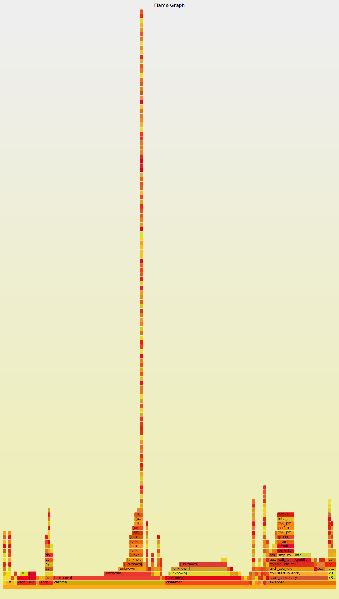
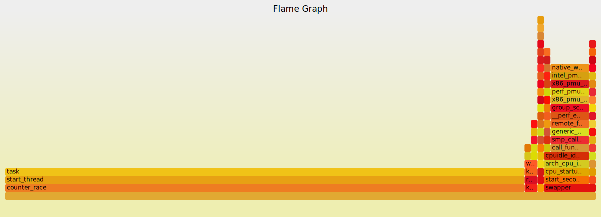
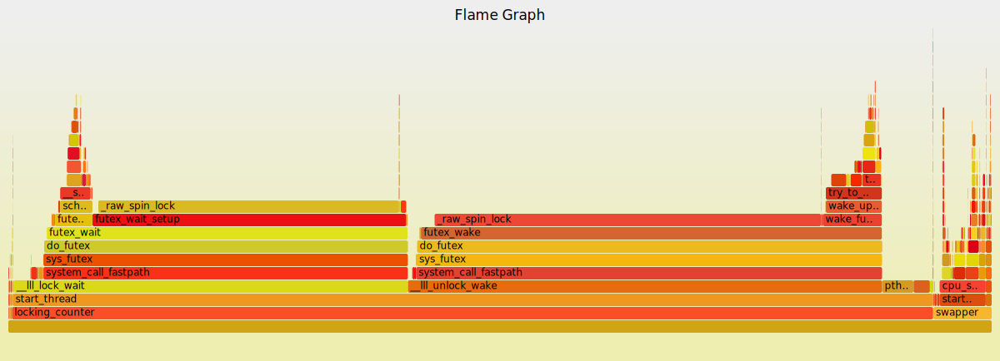
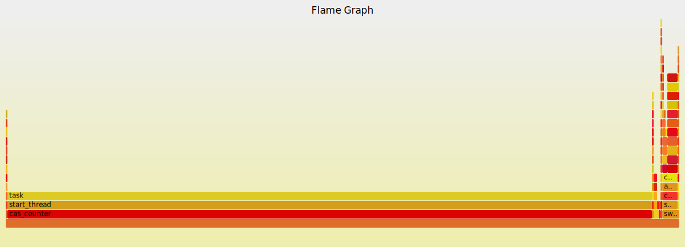

# Perf FlameGraphs

[Flame Graphs](http://www.brendangregg.com/flamegraphs.html) are a great way to visualize stack traces for applications.  They let you see where most of your time is being spent, and just look damn cool! The integration with `perf` is also very simple, the following is all it takes to go from `perf` to a flame graph.

```bash
sudo perf record -F 99 -a -g -- curl -sL -o /dev/null http://google.com 2>&1
sudo perf script | stackcollapse-perf.pl | flamegraph.pl > perf.svg
```

Just record, then convert from `perf` to flamegraph format (`stackcollapse-perf.pl`), then create the svg (`flamegraph.pl > perf.svg`).  Once you do this, you will get the awesome image below!



As we see with this image, when you trace programs without debug symbols (gcc needs `-g` flag to output these) you get a lot of "unknowns".  So lets have some fun with custom code.

# Counter love

Lets create a simple process that spins off multiple threads and updates a counter multiple times.  There are a few ways to do this: no lock, lock, cas.  Below we will go over each.

All graphs below were generated with the same command above.

## No Locking

Without locks, the code shouldn't output the correct data, but should be very fast (0.58user 0.00system 0:00.08elapsed 736%CPU (0avgtext+0avgdata 836maxresident)k); the code can be found [here](../src/main/c/perf-flamegraph/counter_race.c)



## Locking

Now that we have locks, the data will be correct, but its much slower (2.98user 36.38system 0:05.10elapsed 771%CPU (0avgtext+0avgdata 840maxresident)k); the code can be found [here](../src/main/c/perf-flamegraph/locking_counter.c)



## CAS

Compare and Swap will make sure that our updates are correct, but they shouldn't cause as much contention as the locking version so it should be much faster (3.87user 0.00system 0:00.49elapsed 781%CPU (0avgtext+0avgdata 836maxresident)k); the code can be found [here](../src/main/c/perf-flamegraph/cas_counter.c)


